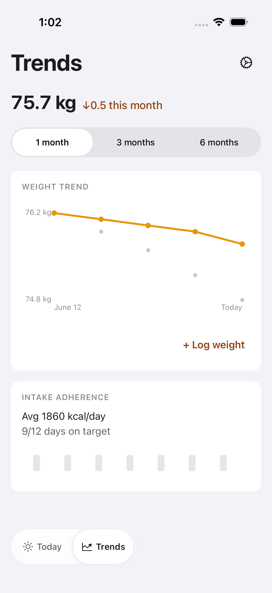
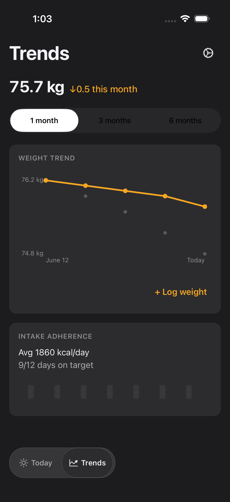
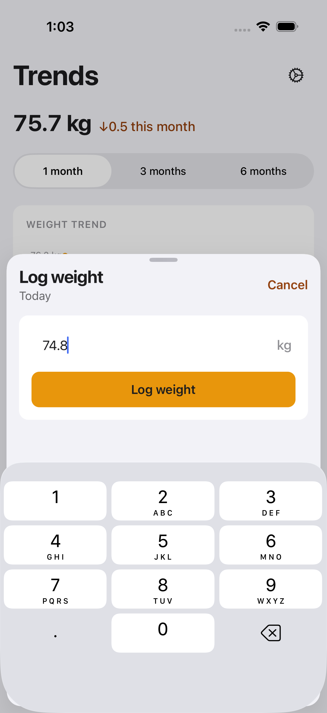
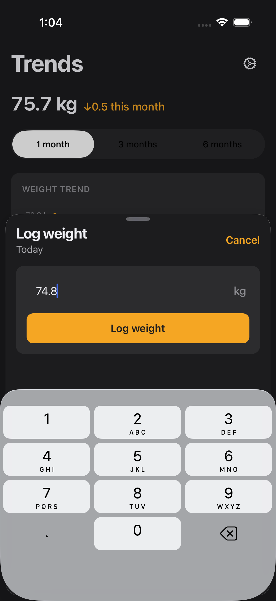
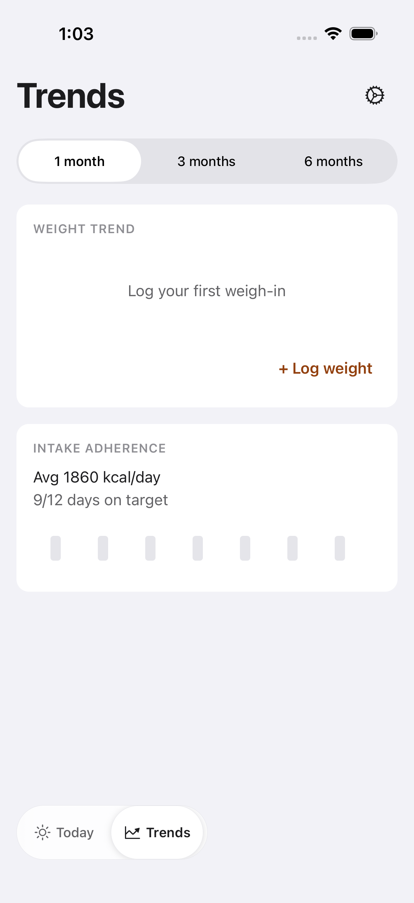
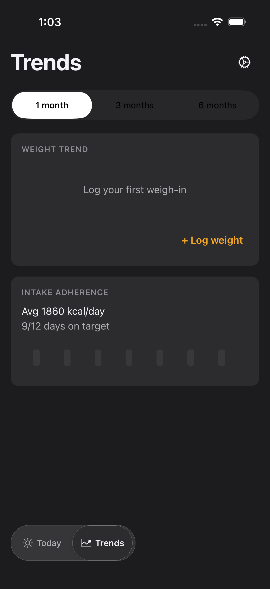

# FTY-238 — End-of-Sweep Visual Audit: Weight (mobile)

One in-depth visual verification pass of the Weight screen after the
accent-as-text (FTY-207..212 / FTY-210) and type-scale (FTY-213..217 / FTY-215)
mechanical sweeps, captured on the iOS simulator through the **FTY-247
visual-review presets** in **both light and dark mode**.

This is a **visual-audit story: no product code was changed.** Any defect found
is recorded here and routed as a planner note / follow-up story rather than fixed
inline (per the story's file-don't-fix scope).

## How these were captured

- Drove this branch's JS (served by a dedicated Metro on the leased slot's port,
  `EXPO_PUBLIC_FATTY_E2E=true`) on a leased iPhone 17 Pro simulator (iOS 26.5)
  from the shared sim-slot pool (`scripts/sim-slot.sh`, label `fty-238`),
  released when captures were done.
- Each state was opened purely through the **FTY-247 visual-review deep link**
  — `fatty://__visual-review?preset=<name>&theme=light|dark` — with **no manual
  RC backend walking or live-state mutation**. Every capture waited for the
  preset's `visual-review-settled:<preset>` marker before the screenshot, so no
  frame is a mid-load frame. The settled-marker assertion passed for all six
  captures.
- All fixtures are FTY-247's synthetic visual-review constants — **no real
  personal weight or body data** appears in any committed screenshot.

## Evidence ↔ acceptance criteria

| Criterion | Evidence |
| --- | --- |
| `docs/verification/FTY-238/` contains light+dark screenshots for every Scope state, plus `findings.md` with a state-by-state verdict | the 6 files below (`weight.populated`, `weight.empty`, `weight.sheet` × light/dark) + this file |
| Every accent-as-text site on Weight is confirmed `accentText`-rendered and AA-legible | Assessment table below — headline delta, `+ Log weight`, and the sheet `Cancel` all render the theme-aware `accentText` token (the darker AA-safe amber on light, the brighter amber on dark), each legible against its surface |
| Type-scale rendering is confirmed regression-free | Assessment table below — every string renders on its `typeScale` token with no clipping, wrapping, truncation, or mis-sizing in any of the six captures |
| Every defect observed has a corresponding planner note; none are fixed here | **No visual defects were observed** on the Weight screen in this audit; nothing to route, nothing changed |
| The PR body embeds the key screenshots (first revision) | done in the PR body |

## Files

Preset-named, light + dark:

### `weight.populated` — the weight list with synthetic entries

### `weight.sheet` — the weight-log entry sheet

### `weight.empty` — the empty state

## Assessment — accent-as-text sites (are they `accentText`, AA-legible?)

The accent-as-text sites on the Weight screen are: the goal-aware headline delta
(`…this month`, `TrendsScreen.tsx`), the `+ Log weight` action label
(`TrendsScreen.tsx`), and the weight-log sheet's `Cancel` control
(`WeightLogSheet.tsx`). The filled **`Log weight`** primary button is *not* an
accent-as-text site: it correctly uses `colors.accent` as its fill with
`accentForeground` for the label — verified rendered that way and not regressed.

| Accent-as-text site | State(s) | Light | Dark |
| --- | --- | --- | --- |
| Headline delta `↓0.5 this month` | populated, sheet (behind) | pass — darker AA-safe amber on the near-white background, clearly distinct from the brighter `accent` chart line | pass — brighter amber, legible on near-black |
| `+ Log weight` label | populated, empty | pass — same darker `accentText` amber, legible on the white card | pass — brighter amber, legible on the dark card |
| Sheet `Cancel` | sheet | pass — darker `accentText` amber on the light sheet surface | pass — brighter amber on the dark sheet surface |

Each site reads as the theme-appropriate `accentText` value (not the raw
`accent`), so text contrast holds in both appearances — the exact outcome the
accent-as-text sweep targeted.

## Assessment — type-scale rendering (regression-free?)

| State | Mode | Type-scale rendering |
| --- | --- | --- |
| `weight.populated` | light | pass — `Trends` large title, `75.7 kg` headline, range selector, `WEIGHT TREND` / `INTAKE ADHERENCE` section labels, axis labels, and adherence copy all render on-token; no clipping/wrap/truncation |
| `weight.populated` | dark | pass — identical layout, on-token, no clipping |
| `weight.empty` | light | pass — `Log your first weigh-in` empty invite + section labels render on-token, no clipping |
| `weight.empty` | dark | pass — identical, on-token |
| `weight.sheet` | light | pass — `Log weight` title, `Today` date subhead, seeded `74.8` value + `kg` unit, and the button label all render on-token; no clipping/truncation |
| `weight.sheet` | dark | pass — identical, on-token |

## Defects found (routed, not fixed inline)

**None.** After the accent-as-text and type-scale sweeps, the Weight screen
renders cleanly across all three states in both appearances: every accent-as-text
site is on the AA-safe `accentText` token and legible, and no text is clipped,
wrapped, truncated, or mis-sized. No planner notes are routed from this audit.

## Notes / limitations

- `weight.empty` overrides only `GET /weight-entries` → `[]`; the intake-adherence
  card keeps its default synthetic fixture, so it still shows `Avg 1860 kcal/day`.
  That is the preset's defined behaviour (the empty state under audit is the
  **weight** card's `Log your first weigh-in` invite), not a defect.
- The `weight.sheet` capture shows the numeric keypad up — the sheet auto-focuses
  its single field on present (the deliberate single-field entry exception), so
  the keyboard is expected in this state.
- Scope is the Weight screen only; other screens have their own audit stories
  (FTY-235..241).
