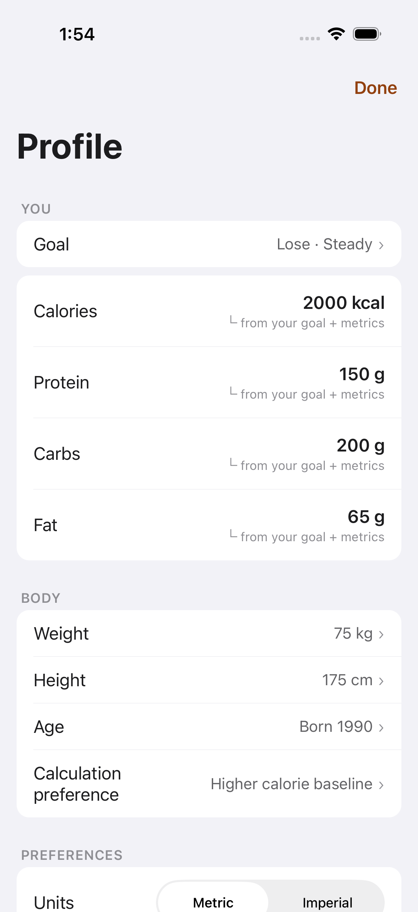
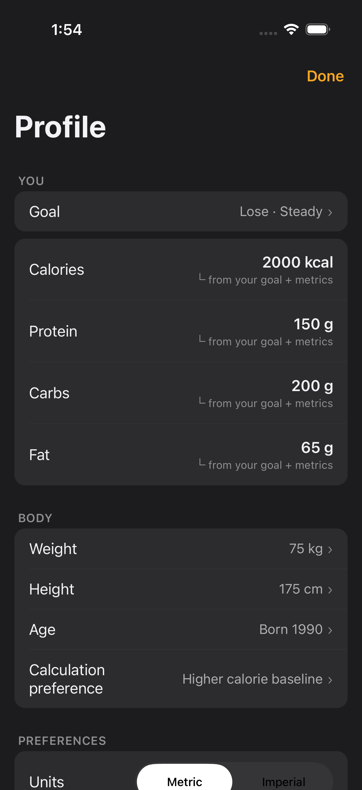
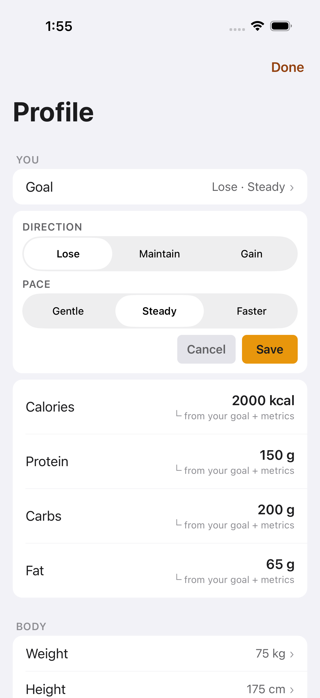
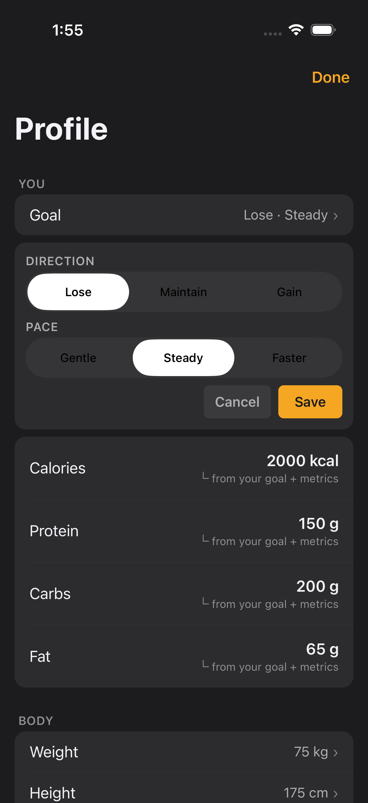
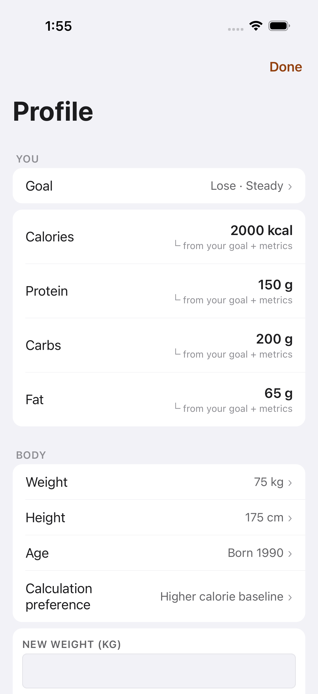
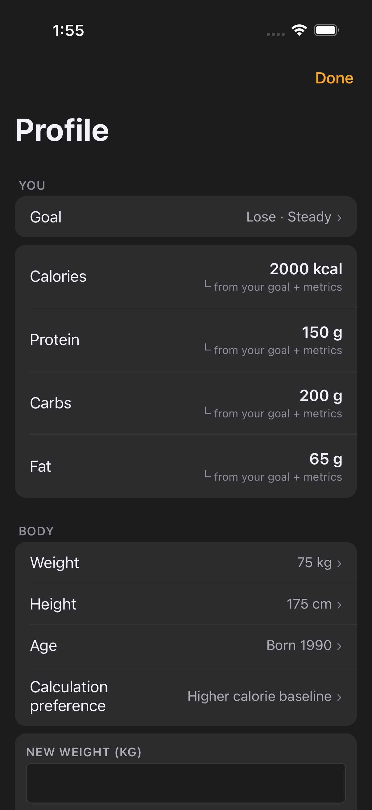
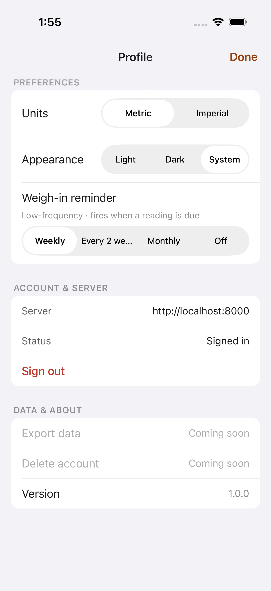
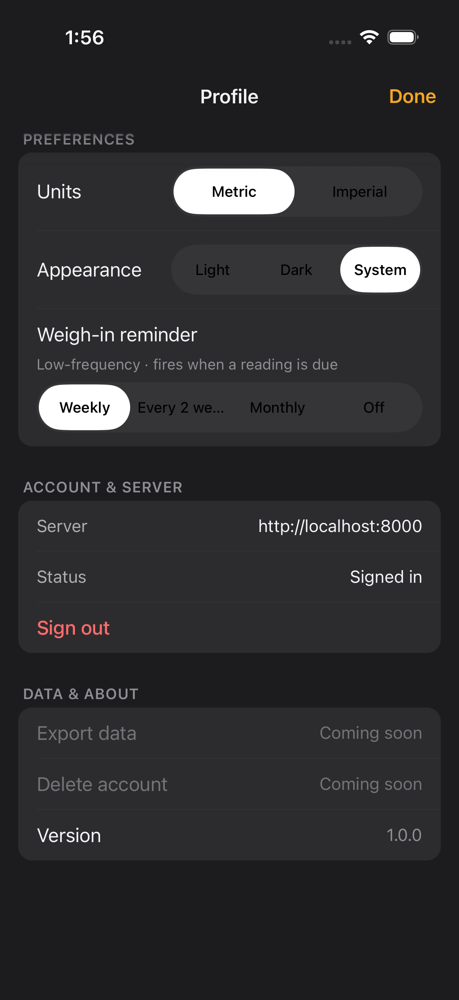

# FTY-240 — End-of-Sweep Visual Audit: Settings (mobile)

One in-depth visual verification pass of the Settings screen after the
accent-as-text (FTY-207..212) and type-scale (FTY-213..217) mechanical sweeps,
captured on the iOS simulator through the **FTY-247 / FTY-267 visual-review
presets** in **both light and dark mode**.

This is a **visual-audit story: no product code was changed.** Any defect found
is recorded here and routed as a planner note / follow-up story rather than fixed
inline (per the story's file-don't-fix scope).

## Scope boundary — accent coverage (per the 2026-07-10 spec revision)

Settings has three FTY-212 accent-as-text sites. Only **one** is reachable
through the four enumerated presets:

1. **Header `Done` label + header tint** (`mobile/app/profile.tsx:49,85`,
   `colors.accentText`) — present in **every** preset. **In scope; audited here.**
2. Target-row user-override label `✎ set by you` (`TargetRow.tsx:56`,
   `accentText` only when a target component is `source:'user'`) — the default
   fixtures serve all components as `source:'derived'`, so the rows render the
   muted `textMuted` provenance (`└ from your goal + metrics`, visible in the
   captures) and the accent state is **unreachable** through the four presets.
3. Metabolic-formula selected label (`BodySection.tsx:186`, `accentText` only
   inside the formula editor) — `settings.body_edit` opens the **weight** editor,
   not the formula editor, so this state is **unreachable** through the four
   presets.

Sites 2 and 3 are **explicitly out of scope** here and are audited by seam story
**FTY-346** (downstream, not a dependency). This audit confirms site 1 across all
four presets; it does not — and per the spec cannot — assert 2 or 3.

## How these were captured

- Drove this branch's JS (served by a dedicated Metro on the leased slot's port,
  `EXPO_PUBLIC_FATTY_E2E=true`) on a leased iPhone simulator (iOS 26.5,
  `Slacks-Slot-1`) from the shared sim-slot pool (`scripts/sim-slot.sh`, label
  `fty-240`), released when captures were done.
- Each state was opened purely through the **FTY-247 visual-review deep link**
  — `fatty://__visual-review?preset=<name>&theme=light|dark` — with **no manual
  RC backend walking or live-state mutation**. Every capture waited for the
  preset's `visual-review-settled:<preset>` marker before the screenshot (and,
  for the three sub-states, additionally asserted the opened card's testID —
  `goal-edit-card`, `body-metric-edit-card`, `appearance-segmented-control`), so
  no frame is a mid-load frame. All eight settled-marker assertions passed.
- All fixtures are FTY-247's synthetic visual-review constants — **no real
  personal body, goal, or server data** appears in any committed screenshot
  (the `http://localhost:8000` server row is the synthetic E2E fixture value).

## Evidence ↔ acceptance criteria

| Criterion | Evidence |
| --- | --- |
| `docs/verification/FTY-240/` contains light+dark screenshots for every Scope state, plus `findings.md` with a state-by-state verdict | the 8 files below (`settings.list`, `settings.goal_edit`, `settings.body_edit`, `settings.appearance` × light/dark) + this file |
| Every accent-as-text site reachable through the four presets is confirmed `accentText`-rendered and AA-legible | Assessment table below — the header `Done` label + tint renders the theme-aware `accentText` token (darker AA-safe amber on light, brighter amber on dark), legible against its surface in all 8 captures. Sites 2/3 are out of scope → FTY-346. |
| Type-scale rendering is confirmed regression-free | Assessment table below — every string renders on its `typeScale` token with no clipping, wrapping, truncation, or mis-sizing versus the pre-sweep layout in any capture. (The `Every 2 we…` segment ellipsis is a native control-width limit, not a type-scale token regression — see Defects.) |
| Every defect observed has a corresponding planner note; none are fixed here | one defect observed (the weigh-in-cadence segment truncation) → routed as an `out_of_scope_bug` planner note; nothing changed |
| The PR body embeds the key screenshots (first revision) | done in the PR body |

## Files

Preset-named, light + dark:

### `settings.list` — the top-level settings list

### `settings.goal_edit` — the goal editor open (direction + pace)

### `settings.body_edit` — the body-metric (weight) editor open

### `settings.appearance` — scrolled to Preferences (Appearance control on screen)

## Assessment — accent-as-text site (is it `accentText`, AA-legible?)

The only FTY-212 accent-as-text site reachable through the four presets is the
header **`Done`** label together with the header tint (`profile.tsx`,
`colors.accentText`). The goal editor's filled **`Save`** button is *not* an
accent-as-text site: it correctly uses `colors.accent` as its fill with the
dark `accentForeground` label — verified rendered that way and not regressed.
The `Sign out` control is the destructive-red token, unrelated to the accent
sweep.

| Accent-as-text site | State(s) | Light | Dark |
| --- | --- | --- | --- |
| Header `Done` label + tint | list, goal_edit, body_edit, appearance | pass — darker AA-safe amber on the near-white header, clearly legible | pass — brighter amber on the near-black header, clearly legible |

The `Done` label reads as the theme-appropriate `accentText` value (not the raw
decorative `accent`), so text contrast holds in both appearances — the exact
outcome the accent-as-text sweep targeted.

## Assessment — type-scale rendering (regression-free?)

| State | Mode | Type-scale rendering |
| --- | --- | --- |
| `settings.list` | light | pass — `Profile` large title, `YOU`/`BODY`/`PREFERENCES` section labels, row labels + values, and the `└ from your goal + metrics` provenance lines all render on-token; no clipping/wrap/truncation |
| `settings.list` | dark | pass — identical layout, on-token, no clipping |
| `settings.goal_edit` | light | pass — `DIRECTION`/`PACE` labels, segmented-control segments, `Cancel`/`Save` labels, and the target/macro rows all render on-token; no clipping |
| `settings.goal_edit` | dark | pass — identical, on-token |
| `settings.body_edit` | light | pass — the opened `NEW WEIGHT (KG)` editor label + input and every list row render on-token; no clipping |
| `settings.body_edit` | dark | pass — identical, on-token |
| `settings.appearance` | light | pass — `Units`/`Appearance`/`Weigh-in reminder` controls, `ACCOUNT & SERVER` + `DATA & ABOUT` rows, and the collapsed `Profile` title all render on-token; body text is not clipped (see Defects for the native segment ellipsis) |
| `settings.appearance` | dark | pass — identical, on-token |

Every string renders at its expected `typeScale` size with no wrapping,
truncation, or mis-sizing attributable to the type-scale sweep. The `Calculation
preference` row label wraps to two lines by design (long label, fully visible) —
not a clip or truncation.

## Defects observed (filed, not fixed)

| # | State | Defect | Disposition |
| --- | --- | --- | --- |
| 1 | `settings.appearance` (light + dark) | The **Weigh-in reminder** cadence segmented control truncates the `Every 2 weeks` option to `Every 2 we…`. This is a native `SegmentedControl` (RNCSegmentedControl) fixed-width limitation, not a type-scale-token regression — the four equal-width segments cannot fit the longest label at the body size. | `out_of_scope_bug` planner note; screenshots `settings-appearance-light.png` / `settings-appearance-dark.png` attached. Pre-existing (also seen in an earlier FTY-240 pass). |

No other visual defects were observed on the Settings screen in this audit.
