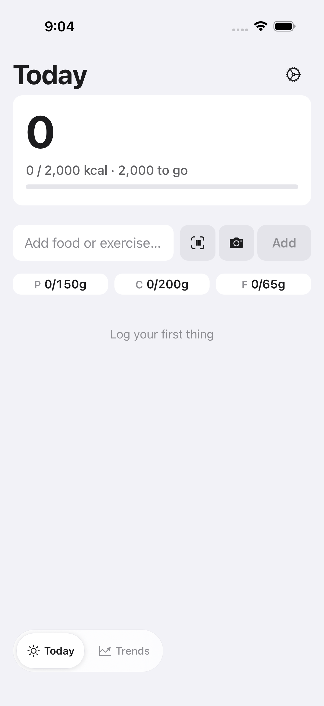
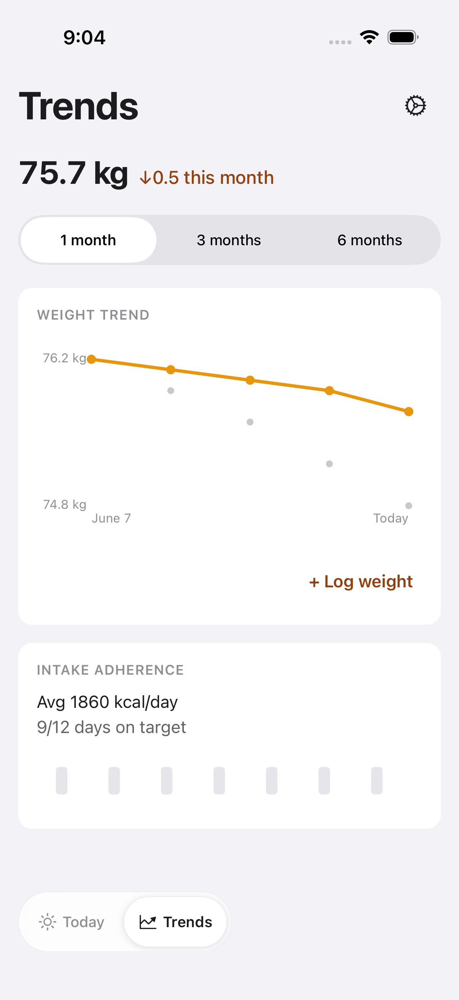
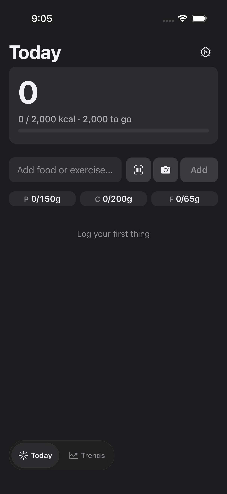
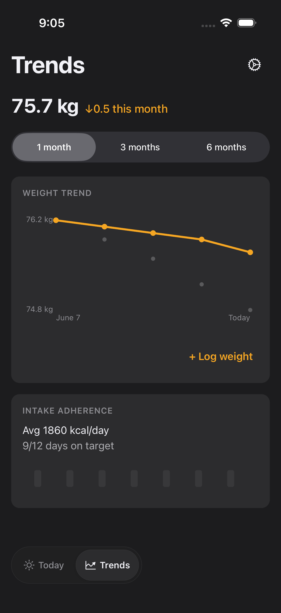
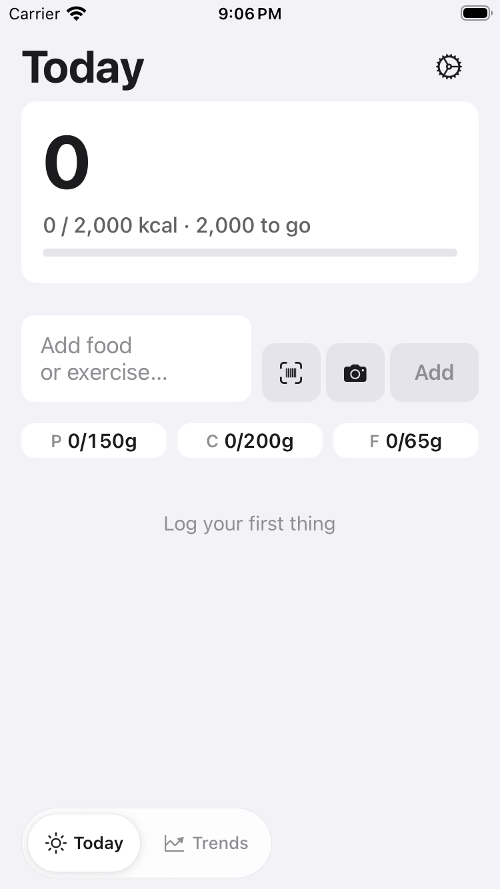
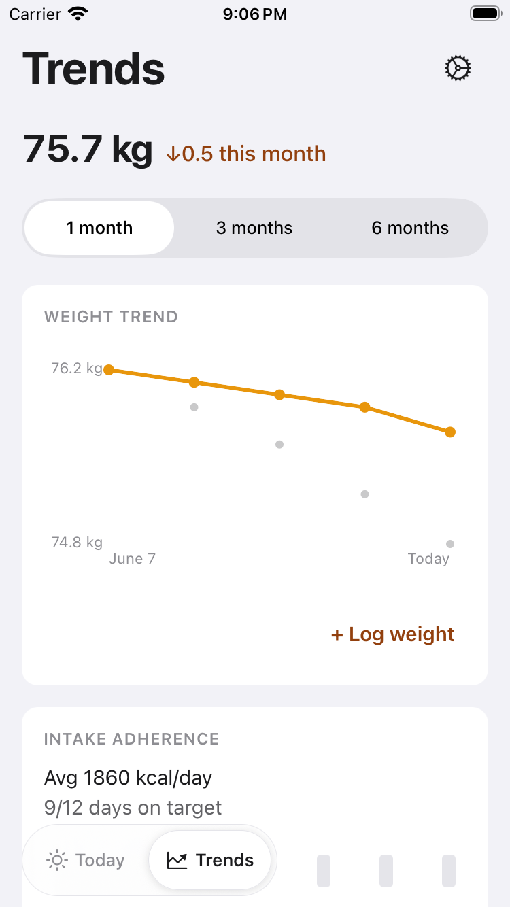
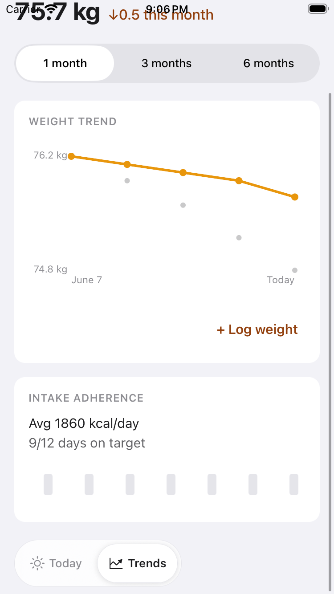
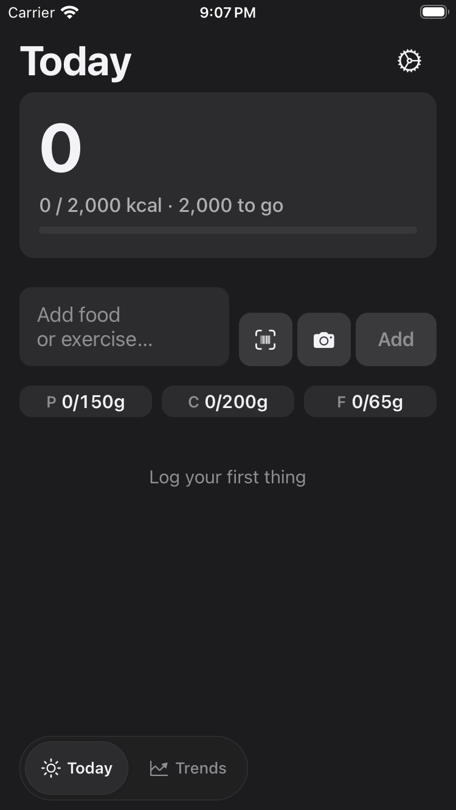
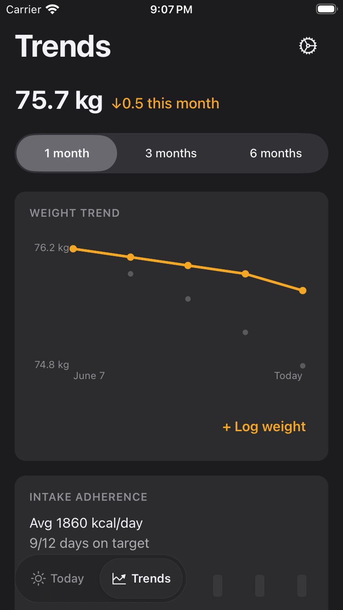
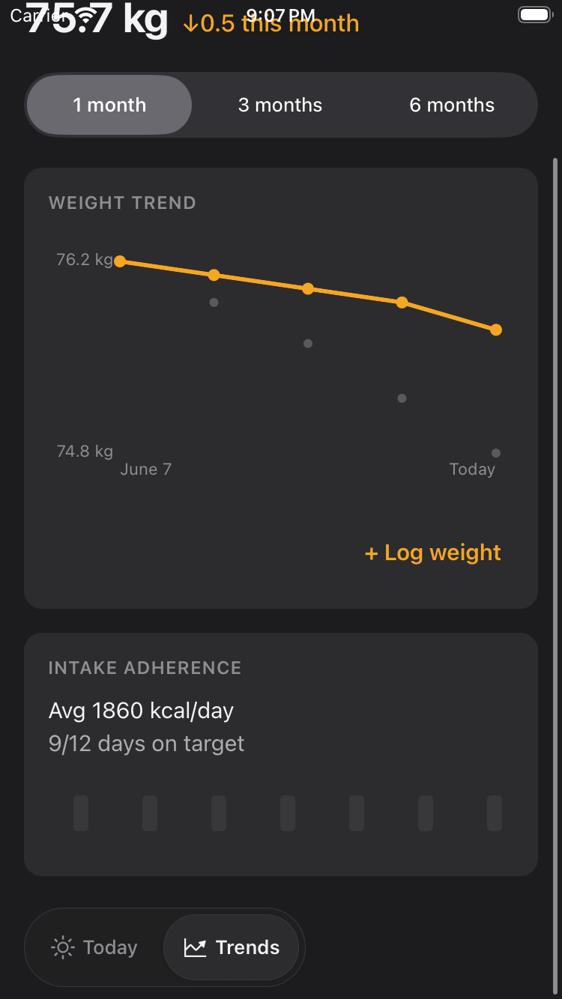

# FTY-242 — Floating glass switcher: running-app visual evidence

Running-app screenshots proving the visual acceptance criteria of the bottom-left
floating glass switcher that replaces the old full-width bottom tab bar.

## How these were captured

- Booted headless simulators via the shared sim-slot pool: **iPhone 17 Pro** (a
  large iPhone) and **iPhone SE (3rd generation)** (SE-class).
- Served this branch's JS through Metro in E2E mode (`EXPO_PUBLIC_FATTY_E2E=true`)
  onto a current debug dev-client binary, driven with Maestro:
  launch → assert `floating-switcher` visible → screenshot Today → tap the
  switcher's Trends segment (`floating-switcher-trends`) → assert `trends-screen`
  → screenshot Trends → scroll near the bottom → screenshot again.
- Each device captured in both **light** and **dark** appearance
  (`xcrun simctl ui … appearance`).

## Evidence ↔ acceptance criteria

| Criterion | Evidence |
| --- | --- |
| No full-width bottom tab bar; Today & Trends reachable via a bottom-left floating glass segmented pill | every screenshot — no full-width bar; the pill sits bottom-left |
| Token-driven light/dark styling, Expo blur material, SF Symbols via `AppIcon`, clear selected state; labels not clipped under Dynamic Type | `*-today.png` (Today segment = raised capsule) vs `*-trends-*.png` (Trends segment = raised capsule); light + dark pairs |
| Each segment navigates to the matching screen; selected state flips | Maestro tapped `floating-switcher-trends` → `trends-screen` mounted (`*-trends-top.png`); tapping `floating-switcher-index` returned to Today |
| Today & Trends reserve bottom clearance on SE-class and large iPhone; bottom content reachable, not occluded | `iphonese-*-trends-bottom.png` (SE scrolls; the last card clears the pill) and `iphone17pro-*-trends-*.png` (content fits above the pill on the large screen) |
| Switcher legible over real app content in light and dark; no unreadable overlap | dark: `*-dark-*.png`; light: `*-light-*.png` — the pill's material stays legible over the Trends cards and the Today hero |

## Files

Large iPhone (iPhone 17 Pro): `iphone17pro-{light,dark}-{today,trends-top,trends-bottom}.png`
SE-class (iPhone SE 3rd gen): `iphonese-{light,dark}-{today,trends-top,trends-bottom}.png`

### iPhone 17 Pro — light

### iPhone 17 Pro — dark

### iPhone SE (3rd gen) — light

### iPhone SE (3rd gen) — dark

## Notes

- On the large iPhone the Trends content fits within the viewport, so the
  "top" and "scrolled" captures are the same frame — the last card already sits
  clear above the pill. On SE-class the screen scrolls, and the scrolled frame
  shows the final content clearing the switcher and home indicator.
- Today is shown in its empty state (E2E mock starts with an empty day); the pill
  placement, material, and selected state are identical regardless of timeline
  content. The provenance/timeline behaviour is unchanged by this story.
