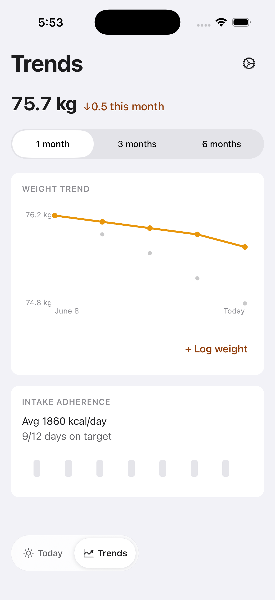
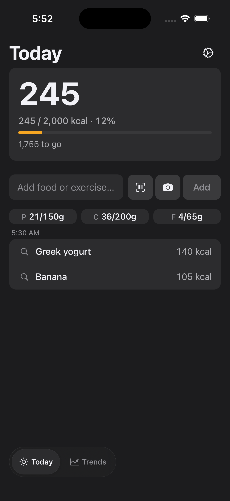
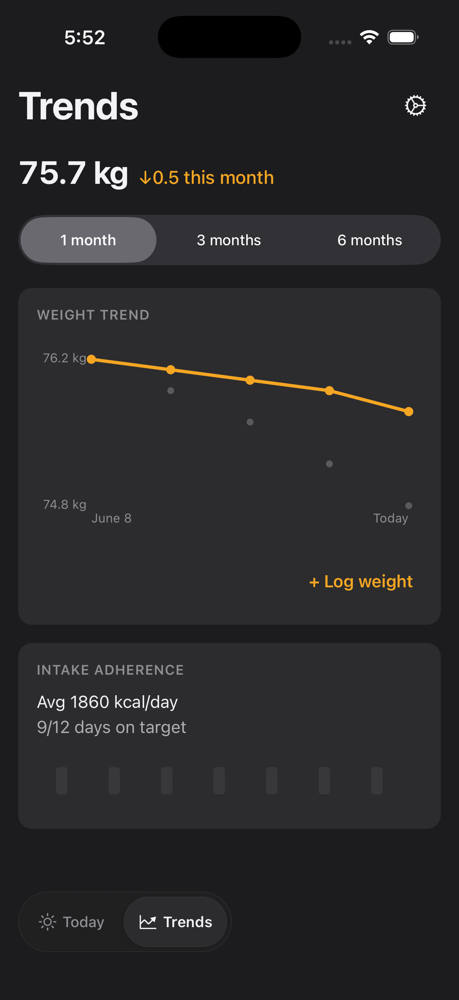
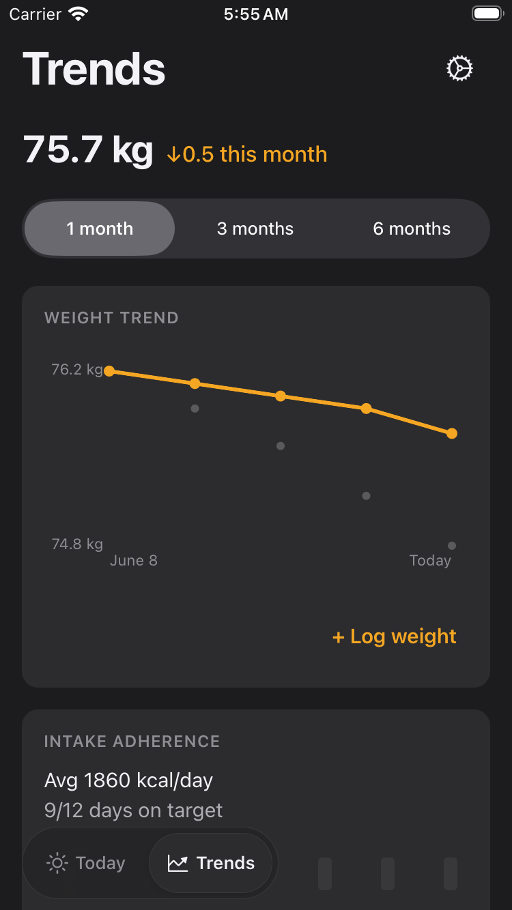
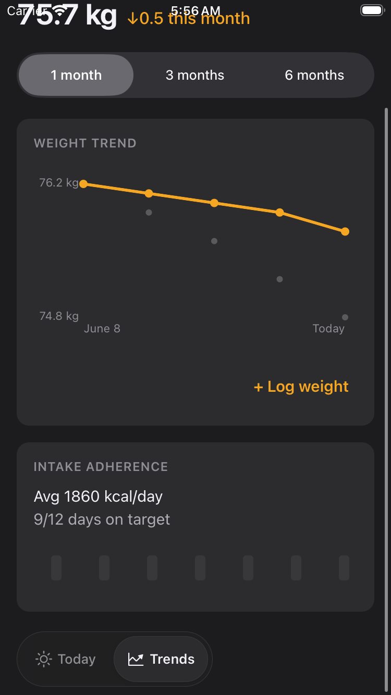

# FTY-259 — Floating glass switcher visual audit: Today + Trends

Running-app screenshots proving the floating glass switcher (FTY-242) reads as
intended over **real, non-empty** Today and Trends content, and checking whether
Today/Trends bottom content is reachable — not trapped under the pill or home
indicator — on an SE-class and a large iPhone. This is a visual-audit story: no
product code was changed. Any defect found is recorded here and routed as a
planner note / follow-up story rather than fixed inline.

## How these were captured

- Built this branch's own dev-client and drove it in the iOS Simulator serving
  this branch's JS with the hermetic E2E fixtures enabled
  (`EXPO_PUBLIC_FATTY_E2E=true`).
- **Large iPhone**: leased an iPhone 17 Pro from the shared sim-slot pool
  (`scripts/sim-slot.sh`, label `FTY-259`) and released it when captures were
  done.
- **SE-class**: a dedicated `iPhone SE (3rd generation)` simulator was created
  for this run, driven directly, and deleted afterward so it left no residual
  state for other concurrent runs.
- **Real, non-empty Today content**: the E2E fixture mock (`mobile/e2e/`) is a
  scripted phase machine keyed on specific raw-text submissions, not a general
  seed — it does not support accumulating many independent rows across multiple
  submissions in one session. The entry-resolve flow's phrase ("greek yogurt and
  banana") was used to log **two real, derived-item rows** ("Greek yogurt,
  140 kcal" / "Banana, 105 kcal") into Today's own timeline via the actual
  composer → submit → pull-to-refresh path (not a fabricated overlay) — the same
  real data-path FTY-181's `resolve.yaml` exercises. This is a genuinely richer
  Today than FTY-242's empty-state captures, though still short of a long
  scrollable feed; see Notes.
- **Real Trends content**: unchanged from FTY-242 — the weight-trend card and
  intake-adherence card render from the E2E weight/daily-summary range fixtures.
- Each device/screen captured in both **light** and **dark** appearance and at
  **top-of-scroll** and **scrolled-near-bottom**.

## Evidence ↔ acceptance criteria

| Criterion | Evidence |
| --- | --- |
| `docs/verification/FTY-259/` contains Today + Trends screenshots, light + dark, SE-class + large iPhone, including scrolled-near-bottom frames, each showing the switcher over real content | all 16 files below |
| Switcher legible over real content, light and dark, clear active segment, no unreadable overlap | every screenshot — the pill's translucent material stays legible over the Today timeline rows and Trends cards in both appearances; the active segment (Today/Trends) is visibly raised/highlighted in every frame |
| Today/Trends bottom content reachable, not occluded by the switcher, on SE-class and large iPhone | large iPhone: `iphone17pro-*-{today,trends}-top.png` and the matching `-bottom.png` are pixel-identical (content already fits above the pill — same pattern FTY-242 documented); SE-class Today: `iphonese-*-today-top.png` / `-bottom.png` are likewise identical (2 real rows still fit above the pill on SE); SE-class Trends: `iphonese-*-trends-top.png` shows the intake-adherence card's day-bar row partly under the pill at rest, and `iphonese-*-trends-bottom.png` shows the same row fully cleared after scrolling — the reserved-clearance contract (FTY-258) working as designed at the **bottom** of the screen. **The same SE-class Trends scrolled frames also surface a separate top-of-screen defect — see Defects found.** |

## Files

Large iPhone (iPhone 17 Pro): `iphone17pro-{light,dark}-{today,trends}-{top,bottom}.png`
SE-class (iPhone SE 3rd gen): `iphonese-{light,dark}-{today,trends}-{top,bottom}.png`

### iPhone 17 Pro — light

### iPhone 17 Pro — dark

### iPhone SE (3rd gen) — light

### iPhone SE (3rd gen) — dark

## Assessment — per device size and mode

**Switcher legibility** — the floating pill's active/inactive segments and their
labels are read against real content in every frame:

| Device | Mode | Switcher legible? |
| --- | --- | --- |
| iPhone 17 Pro | light | pass — active segment clearly raised, labels crisp over Today rows / Trends cards |
| iPhone 17 Pro | dark | pass — same, material stays readable over the dark background |
| iPhone SE (3rd gen) | light | pass |
| iPhone SE (3rd gen) | dark | pass |

**Bottom-content occlusion by the switcher** — whether Today/Trends content is
reachable and not trapped under the floating pill / home indicator:

| Device | Mode | Screen | Bottom content occluded by switcher? |
| --- | --- | --- | --- |
| iPhone 17 Pro | light & dark | Today | no — content fits above the pill; top/bottom frames identical |
| iPhone 17 Pro | light & dark | Trends | no — content fits above the pill; top/bottom frames identical |
| iPhone SE (3rd gen) | light & dark | Today | no — 2 real rows fit above the pill; top/bottom frames identical |
| iPhone SE (3rd gen) | light & dark | Trends | no — intake-adherence card sits partly under the pill at rest and scrolls fully clear (FTY-258 reserved clearance) |

The floating switcher itself does **not** occlude bottom content on any
device/mode: at the bottom of every screen the content either fits above the
pill or scrolls fully clear of it.

## Defects found (routed, not fixed inline)

- **SE-class Trends header overlaps the status bar when scrolled** (light and
  dark). On the iPhone SE (3rd gen), scrolling Trends toward the bottom pulls the
  `75.7 kg ↓0.5 this month` weight-summary line up to the very top of the screen,
  where it **overlaps the iOS status bar** (carrier / clock / battery) with no
  safe-area top inset or opaque status-bar background — see
  `iphonese-light-trends-bottom.png` and `iphonese-dark-trends-bottom.png`. It is
  visible on the SE-class only because that device's Trends content overflows the
  viewport; the larger iPhone 17 Pro Trends content fits without scrolling
  (top/bottom frames identical) so it never reproduces there. This is a
  **top-of-screen** defect on the Trends scroll container and is unrelated to the
  floating switcher (which sits at the bottom and behaves correctly). Per this
  story's audit-only scope it is **not fixed here** — it is filed as an
  out-of-scope planner note for a dedicated follow-up (add a top safe-area inset /
  status-bar clip to the Trends scroll content).

- **Pre-existing dev-mode redbox on cold launch** (filed as a planner note, not
  fixed here): a stray Jest test file lives directly at `mobile/app/day.test.tsx`
  — inside Expo Router's file-based route root — instead of a non-route location.
  Router eagerly validates every file under `app/` at startup, so it evaluates
  this test file too; its top-level `jest.mock(...)` call throws
  (`Property 'jest' doesn't exist`) since no test runner is present in a real app
  process, producing a LogBox redbox on every cold launch (dismissible in 2 taps;
  the app is fully functional underneath — confirmed by every flow in this audit
  completing normally after dismissal). Unrelated to the floating switcher.

## Notes / limitations

- **Today's real content ceiling**: the hermetic E2E mock is a single-flow phase
  machine (each distinct raw-text submission sets its own stage flag, but the
  by-date/list reads only ever serve ONE flow's result at a time, keyed by a
  fixed priority order) — it cannot be made to accumulate many independent rows
  without changing `mobile/e2e/` fixtures, which is out of this audit's scope (no
  product/test-fixture code changes). Two real rows is the practical ceiling
  reachable through the existing hermetic flows, and on both device sizes that
  content still fits above the switcher without forcing a scroll. The
  scrolled-near-bottom Today frames are therefore pixel-identical to the
  top-of-scroll frames on both devices — a real, if modest, verification of "no
  occlusion" rather than a demonstration of scroll-driven reveal. Trends
  (unchanged, richer fixture content) is what exercises the genuine
  scroll/occlusion-clearing behaviour on SE-class.
</content>
</invoke>
