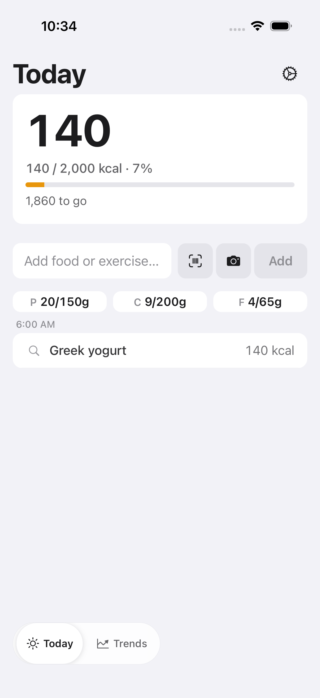
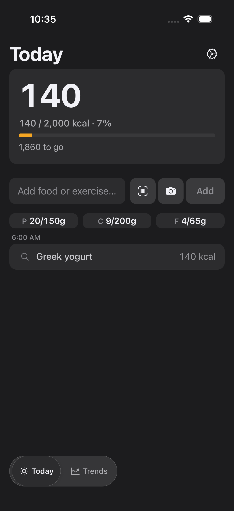
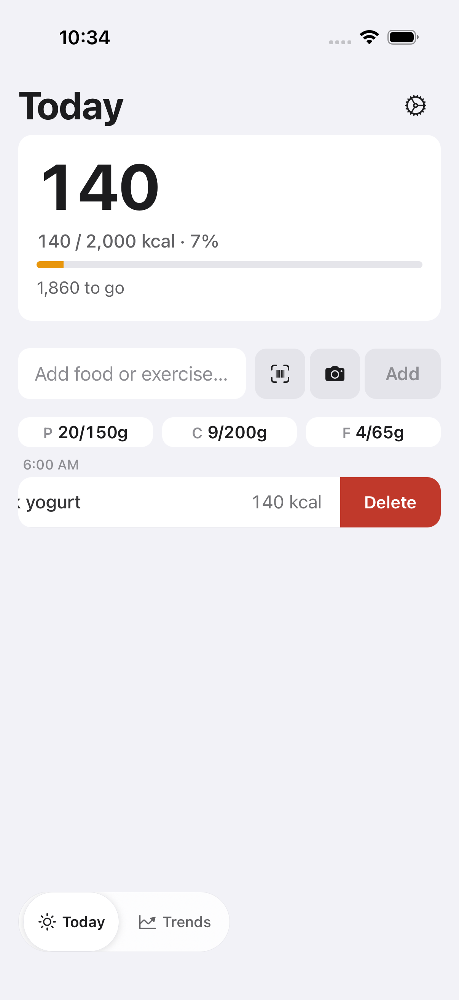
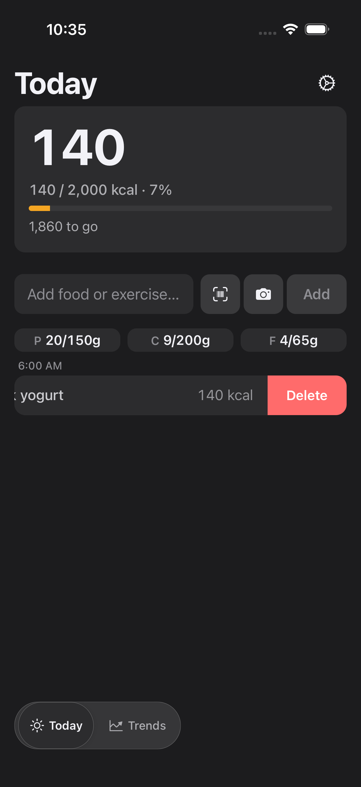
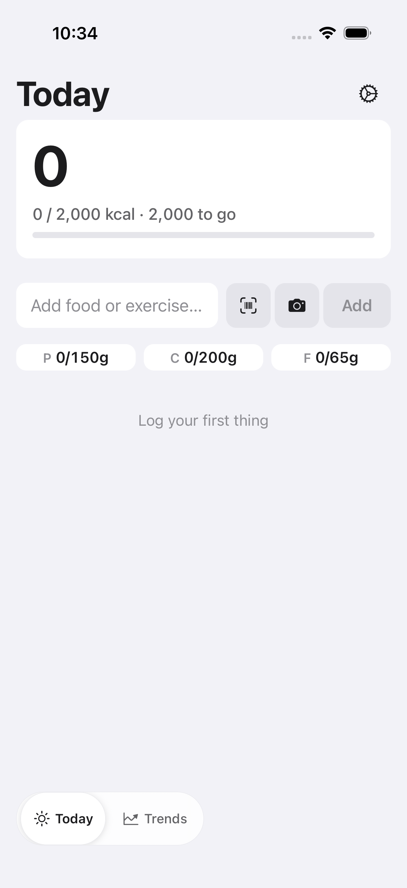
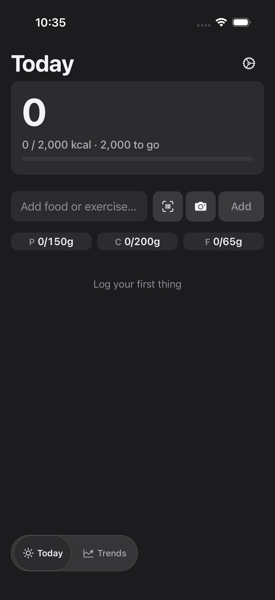

# FTY-322 — Delete a logged item from the Today timeline: running-app evidence

Captured on a leased iOS simulator (iPhone 17, iOS 26.5) against the E2E debug
build (`EXPO_PUBLIC_FATTY_E2E=true`) serving this branch's JS, driving the
committed `mobile/.maestro/delete.yaml` flow (parameterised with `takeScreenshot`
steps for capture). Theme forced with `xcrun simctl ui <udid> appearance
light|dark`; the app follows system appearance.

The flow logs "yogurt to delete", pulls to refresh so it resolves to a counted
`Greek yogurt, 140 kcal` row (hero 140 / 2,000 kcal), swipes the row left to
reveal the destructive **Delete** action, taps it, and asserts the row leaves the
timeline and the hero returns to 0 — every step reported `COMPLETED` on-device.

## Acceptance criteria proven here

- **Swipe-left reveals a destructive Delete; tapping removes the row and updates
  the day totals.** `02-revealed` shows the row slid aside revealing the red
  Delete button; `03-after` shows the row gone and the hero back to
  `0 / 2,000 kcal` with macros zeroed. The Maestro `notVisible` assertion after
  the tap passed.
- **No layout shift on rows not being swiped / calm in place.** The hero,
  composer, and macro tiles are unchanged between `01-before` and `02-revealed`;
  only the swiped row translates.
- **Native, on-brand rendering in light and dark.** Both themes render the
  standard iOS swipe action with the warm destructive accent (`colors.coral`)
  and legible white label.

## Screenshots

### Before — resolved row counting toward the hero

| Light | Dark |
| --- | --- |
|  |  |

### Swipe-revealed destructive Delete action

| Light | Dark |
| --- | --- |
|  |  |

### After delete — row gone, hero back to zero

| Light | Dark |
| --- | --- |
|  |  |
