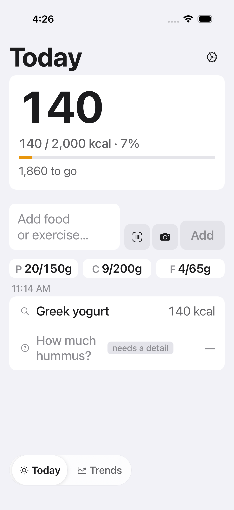
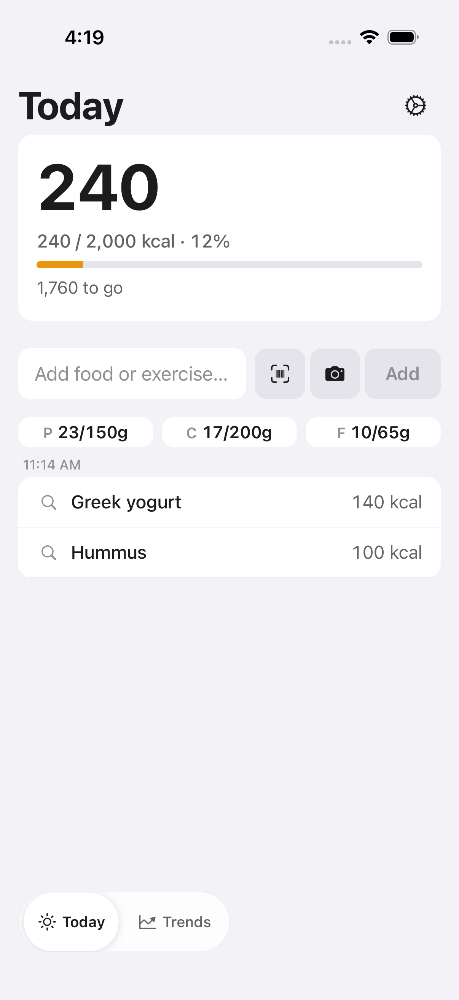

# FTY-330 — Today timeline displays partially resolved entries

Running-app evidence for the `partially_resolved` timeline state, captured on a
leased headless iOS simulator (iPhone 17, iOS 26.5) from an E2E-mode build
serving this branch's JS.

Two complementary harnesses drive the evidence:

1. A **hermetic end-to-end Maestro flow** (`mobile/.maestro/partial-resolution.yaml`)
   that submits a fixture mixed log, observes the partial render, answers the
   item-scoped question, and observes the event complete in place — all against
   the E2E mock fetch (`createE2EMockFetch`), no live backend.
2. The **FTY-247 visual-review preset** (`today.partially_resolved`), reached
   through the `isE2EMode()` deep-link seam, for deterministic light/dark and
   Dynamic Type visual captures on initial load:
   ```
   fatty://__visual-review?preset=today.partially_resolved&theme=light|dark
   ```

## Screenshots

| State | Screenshot |
| --- | --- |
| Partial render, light |  |
| Partial render, dark |  |
| Partial render, Dynamic Type (xxxLarge) |  |
| Completed in place (after answering) |  |

## What the evidence proves (acceptance criteria)

The mixed log **"greek yogurt and some hummus"** resolves the yogurt and leaves
the hummus open:

- **Resolved sibling counts immediately.** The committed **"Greek yogurt · 140
  kcal"** row renders as a normal counted item row with its trusted-source
  provenance icon. The hero reads **140 / 2,000 kcal · 7%** and the macro tier
  (P 20/150g · C 9/200g · F 4/65g) reflects the sibling — the resolved item feeds
  the day totals per the daily-summary semantics.
- **One item-named pending-question row per open component, legible (not
  clipped).** The open component renders **"How much hummus? · needs a detail ·
  —"** — muted, tagged, visibly uncounted, named by the question text. The
  question text now **wraps to as many lines as it needs** instead of clipping to
  "How much hum…" (the round-1 defect): the light/dark captures show the full
  "How much hummus?" on two lines, and the **Dynamic Type (xxxLarge)** capture
  shows it wrapping cleanly by word and staying fully legible at the largest
  standard text size. Its VoiceOver label is *"How much hummus?, needs a detail,
  uncounted"* and it is a ≥44 pt tap target opening the clarify sheet
  pre-targeted to that component's own question.
- **Answering completes the event in place.** The end-to-end Maestro flow taps
  the pending-question row → the clarify sheet opens pre-targeted to the hummus
  question with its quick-pick chips → answering resolves the **same event** in
  place. The completed capture proves the outcome: the **Greek yogurt · 140 kcal**
  row is unchanged (same row, in place) and the answered component is now a normal
  counted **Hummus · 100 kcal** row, with the hero at **240 / 2,000 kcal · 12%**
  and the open-question uncounted unit cleared — no duplicate row, sibling
  untouched.
- **Light + dark both legible.** The counted row and the muted pending-question
  row read correctly against both surfaces.

## Maestro flow (hermetic fixture mode)

`mobile/.maestro/partial-resolution.yaml` drives the full acceptance path through
the E2E mock's partial phase machine (keyed on the raw phrase's own state, so it
never collides with the clarify/other flows):

```
submit "greek yogurt and some hummus"
  → partially_resolved: pending-question row "How much hummus?" (full text)
  → refresh: committed "Greek yogurt · 140 kcal" counts (hero 140 kcal)
  → tap question row → clarify sheet (question + "2 tbsp"/"1/4 cup" chips)
  → answer "2 tbsp" → event resolves in place
  → refresh: "Greek yogurt · 140 kcal" unchanged AND "Hummus · 100 kcal" counted
    (hero 240 kcal), open question gone
```

The flow is **text/label-based** — the same shape as the committed
`clarify.yaml` chip-answer flow — so it runs green wherever the e2e suite runs.
On this Mac's local iOS simulator the NativeSheet's inner content (the answer
chips) is not exposed in the accessibility tree (a known iOS-sim limitation;
sheet-content interaction is the tested surface on Android's Modal fallback,
exactly as `clarify.yaml` relies on), so the local iOS run was completed with a
coordinate tap on the chip to capture the completed-in-place screenshot above;
the committed flow keeps the portable text tap.

The mock's partial phase machine and its in-place completion are additionally
pinned by unit tests in `mobile/e2e/launchMode.test.ts`
(`FTY-330 partial-resolution flow`).

## Component / hook coverage

- `mobile/components/TodayScreenPartialResolution.test.tsx` — full-screen flow:
  render → tap pending-question row → answer targets that question id → event
  re-estimates in place (sibling row untouched) → completes.
- `mobile/components/today/usePartialClarifications.test.tsx` — the question
  fetch/mapping, the keep-last-known-on-failure behaviour, and the retry that
  keeps an open component from being hidden by a transient first-read failure.
- `mobile/components/today/visualReviewEntryRows.test.tsx`,
  `mobile/components/today/helpers.test.ts` — the preset data path and the
  placeholder/totals helpers.

## Reproduce

Serve this branch's JS in E2E mode on a leased simulator, then:

```
EXPO_PUBLIC_FATTY_E2E=true npx expo start --dev-client --port "$SLACKS_METRO_PORT"

# End-to-end hermetic flow:
maestro --udid "$SLACKS_SIM_UDID" test mobile/.maestro/partial-resolution.yaml

# Visual captures (light/dark/Dynamic Type) via the FTY-247 preset:
#   fatty://__visual-review?preset=today.partially_resolved&theme=light|dark
#   (Dynamic Type: xcrun simctl ui "$SLACKS_SIM_UDID" content_size extra-extra-extra-large)
```
