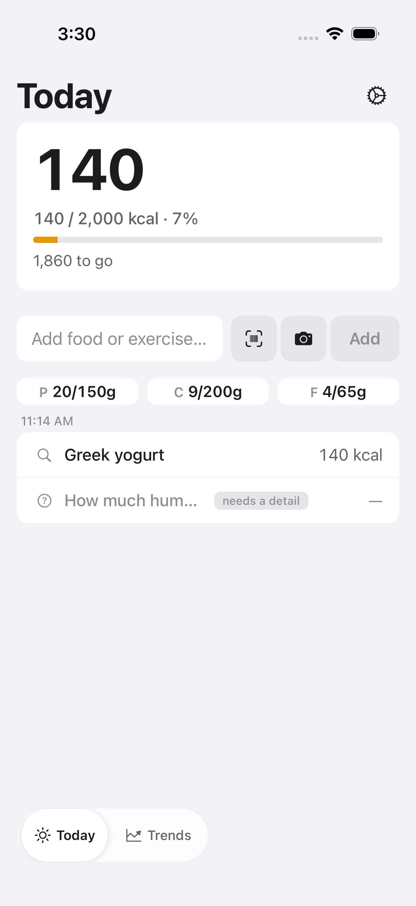
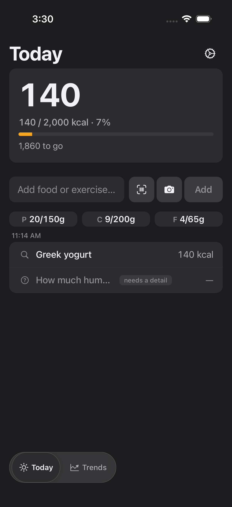

# FTY-330 — Today timeline displays partially resolved entries

Running-app visual evidence for the `partially_resolved` timeline state, captured
on a leased headless iOS simulator (iPhone 17, iOS 26.5) from an E2E-mode build
serving this branch's JS. The screen is reached through the `isE2EMode()`
visual-review deep-link seam (no live backend, no scripted taps):

```
fatty://__visual-review?preset=today.partially_resolved&theme=light|dark
```

The preset (`mobile/components/today/visualReviewEntryRows.ts`) seeds the real
Today data reads — the event list, the item-forward by-date feed (the committed
sibling), the status-gated clarification read (the open component's question),
and the daily summary — so `ClusterView` renders the genuine partial-resolution
branch on initial load. Each capture is gated on the
`visual-review-settled:today.partially_resolved` marker (data loaded + network
quiet), so the frame is the fully-settled screen.

## Screenshots

| Theme | Screenshot |
| --- | --- |
| Light |  |
| Dark |  |

## What the evidence proves (acceptance criteria)

The mixed log **"greek yogurt and some hummus"** resolves the yogurt and leaves
the hummus open:

- **Resolved sibling counts immediately.** The committed **"Greek yogurt · 140
  kcal"** row renders as a normal counted item row with its trusted-source
  provenance icon — not muted, not uncounted. The hero reads **140 / 2,000 kcal ·
  7%**, and the macro tier (P 20/150g · C 9/200g · F 4/65g) reflects the sibling,
  proving the resolved item feeds the day totals per the daily-summary semantics.
- **One item-named pending-question row per open component.** The open component
  renders **"How much hummus? · needs a detail · —"** — muted, tagged, and visibly
  uncounted (em-dash), named by the question text, never by the raw diary phrase
  (which appears on no row). Its VoiceOver label is
  *"How much hummus?, needs a detail, uncounted"* and it is a ≥44 pt tap target
  that opens the clarify sheet pre-targeted to that component's own question.
- **Light + dark both legible.** The counted row and the muted pending-question
  row are legible against both surfaces; the amber accent and provenance/`?`
  icons read correctly in each theme.

The answer-completes-in-place flow, the sibling-untouched re-estimate, the
per-question `uncounted_entries` semantics, and the unchanged whole-event
`needs_clarification` rendering are exercised to completion by the component
suites:

- `mobile/components/TodayScreenPartialResolution.test.tsx` — full-screen flow:
  render → tap pending-question row → answer targets that question id → event
  re-estimates in place (sibling row untouched) → completes.
- `mobile/components/today/visualReviewEntryRows.test.tsx` — drives the same
  `today.partially_resolved` preset through the real Today data path and asserts
  the counted row + pending-question row + settled marker.
- `mobile/components/today/usePartialClarifications.test.tsx`,
  `mobile/components/today/helpers.test.ts` — the question fetch/mapping and the
  placeholder/totals helpers.

## Reproduce

Serve this branch's JS in E2E mode on a leased simulator, then drive the seam:

```
EXPO_PUBLIC_FATTY_E2E=true npx expo start --dev-client --port "$SLACKS_METRO_PORT"
maestro --udid "$SLACKS_SIM_UDID" test mobile/.maestro/visual-review-smoke.yaml
# → today-partially-resolved-light / today-partially-resolved-dark
```

The two capture blocks live in the committed
`mobile/.maestro/visual-review-smoke.yaml` (`today.partially_resolved`, light +
dark), so this evidence re-runs under `verify-e2e.sh`.
