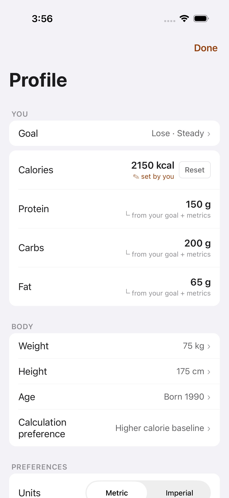
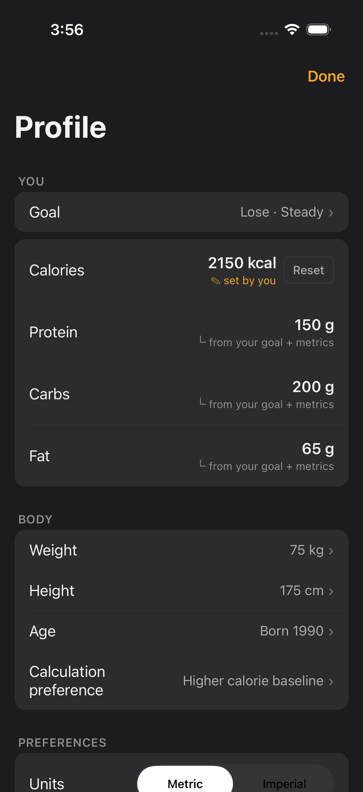
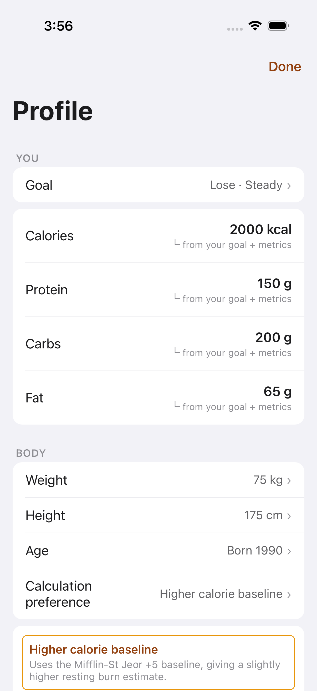
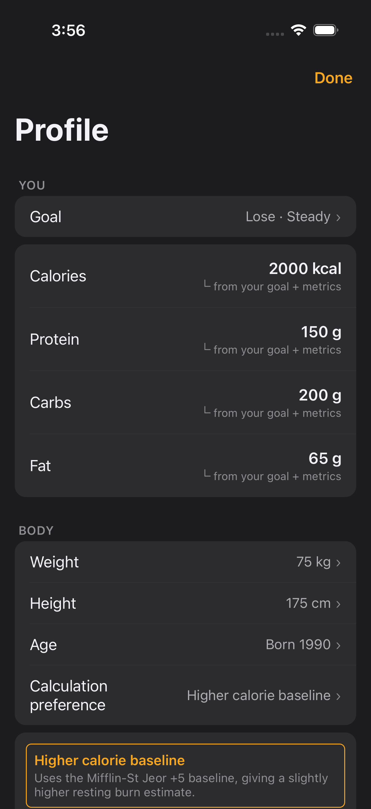

# FTY-346 — Settings accent visual review: target-override + formula-editor labels

Light + dark simulator evidence for the two FTY-212 accent-as-text sites that
FTY-240's four presets could not reach (see that audit's scope boundary):

1. **Target-row user-override provenance label** — `✎ set by you`
   (`mobile/components/settings/TargetRow.tsx:56`, `colors.accentText` when the
   target component is `source:'user'`).
2. **Formula-editor selected-formula label** — the selected option's title inside
   the calculation-preference editor
   (`mobile/components/settings/BodySection.tsx:186`, `colors.accentText` when
   `selected`).

Both states were reached purely through this story's E2E-only initial-state
seam / synthetic fixtures — the `settings.target_override` and
`settings.formula_edit` presets registered from settings-owned code via
FTY-247's registration API — with **no scripted taps, no live backend, and no
real personal data** (all values are the synthetic E2E fixture constants).

## How these were captured

- Drove this branch's JS (dedicated Metro on the leased slot's port,
  `EXPO_PUBLIC_FATTY_E2E=true`) on a leased iPhone simulator (iOS 26.5,
  `Slacks-Slot-1`) from the shared sim-slot pool (`scripts/sim-slot.sh`, label
  `fty-346`), released when captures were done.
- The four screenshots are the `takeScreenshot` outputs of a fully green run of
  the **committed smoke flow** (`mobile/.maestro/visual-review-smoke.yaml`),
  which opens each preset via the FTY-247 deep link
  (`fatty://__visual-review?preset=<name>&theme=light|dark`), waits for its
  `visual-review-settled:<preset>` marker, and asserts the state's own content
  (`.*Set by you.*` — the override row's folded accessibility label — for the
  target-override preset; the `formula-edit-card` testID for the formula-edit
  preset) before capturing. No frame is a mid-load frame.
- The target-override state is an inline list row, so the shared
  navigator-level sibling-overlay settled marker applies; the formula editor is
  an inline `EditCard` (not a `Modal`), so the same shared marker pattern
  applies there too — no in-modal marker is needed (FTY-270 convention checked;
  not applicable here).

## Files

### `settings.target_override` — target section with a `source:'user'` calories component

### `settings.formula_edit` — formula editor open with the loaded formula selected

Capture note: the formula editor opens inline at the Calculation-preference
row's list position, so the bottom of the edit card sits at the viewport edge;
the selected-formula label (the accent site under audit) is fully visible in
both captures.

## Assessment — does each site render `colors.accentText`, and is it AA-legible?

Both labels render on the raised card surface (`colors.surfaceRaised`: light
`#FFFFFF`, dark `#2C2C2E`). Contrast ratios computed with the WCAG 2.x relative
luminance formula for the theme's `accentText` token (light `#92400E`, dark
`#F5A623`, `mobile/theme/colors.ts`):

| Site | Mode | Rendered token | Contrast vs `surfaceRaised` | AA (≥ 4.5:1) |
| --- | --- | --- | --- | --- |
| Target-row `✎ set by you` | light | `accentText` `#92400E` — darker AA amber, visibly distinct from the decorative `accent` fill of controls | 7.09:1 | pass |
| Target-row `✎ set by you` | dark | `accentText` `#F5A623` — brighter amber | 6.88:1 | pass |
| Formula selected label | light | `accentText` `#92400E` | 7.09:1 | pass |
| Formula selected label | dark | `accentText` `#F5A623` | 6.88:1 | pass |

Visual confirmation matches the math: in the light captures the labels read as
the darker burnt-amber `accentText` (clearly not the raw `#E8960C` `accent`
used for the selected option's border, visible side-by-side in the formula-edit
captures), and in dark mode the brighter amber is crisply legible on the raised
card. The sibling derived rows (`└ from your goal + metrics`) stay on
`textMuted`, confirming the accent branch only fires for the `source:'user'`
component / the selected formula.

## Defects observed

None. Both states render cleanly in both themes — no clipping, truncation,
mis-theming, or contrast issue was observed in the four captures, so no
`out_of_scope_bug` planner note is needed from this audit.
