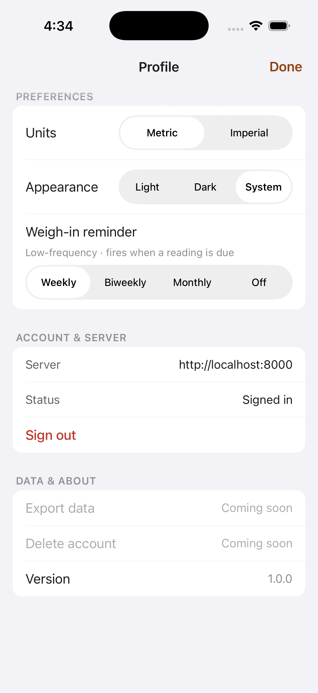
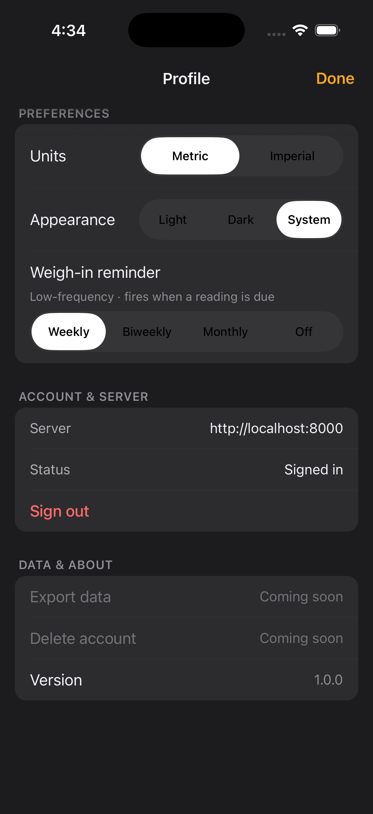

# FTY-347 — Weigh-in cadence segmented control truncation fix

## Defect

The Settings → PREFERENCES "Weigh-in reminder" native `UISegmentedControl` lays
its four segments out at equal width. The longest label, `Every 2 weeks`,
overflowed its segment and truncated to an ambiguous `Every 2 we…` on the
narrowest supported phone (FTY-240 evidence, PR #301).

## Fix

Display-copy only: `CADENCE_OPTIONS[].label` in
`mobile/state/reminderScheduler.ts` changed `Every 2 weeks` → `Biweekly`, giving
a consistent short set `Weekly / Biweekly / Monthly / Off` that fits four
equal-width segments without ellipsis. `Biweekly` sits between `Weekly` and
`Monthly`, which disambiguates it as *every two weeks*.

`value` (`weekly|biweekly|monthly|off`), `days` (7/14/30/null), the
`WeighInCadence` enum, persistence, reminder scheduling, and the
`Weigh-in cadence` accessibility label are all unchanged — verified by the
existing `reminderScheduler` / `SettingsScreen` tests and a new label assertion.

## Running-app evidence

Captured on the leased slot simulator (`Slacks-Slot-0`, **iPhone 17 Pro** —
393 pt, the narrowest supported non-Max/non-Air width), this branch's JS served
from Metro in E2E mode, via the `settings.appearance` visual-review preset with
`&theme=light` / `&theme=dark`.

### Light

All four labels render in full: **Weekly · Biweekly · Monthly · Off**. No
ellipsis; `Weekly` selected.

### Dark

All four labels render in full and legible in dark mode: **Weekly · Biweekly ·
Monthly · Off**. No truncation.
