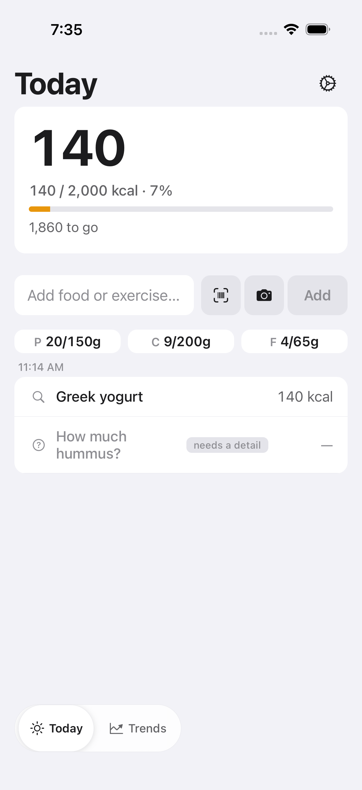
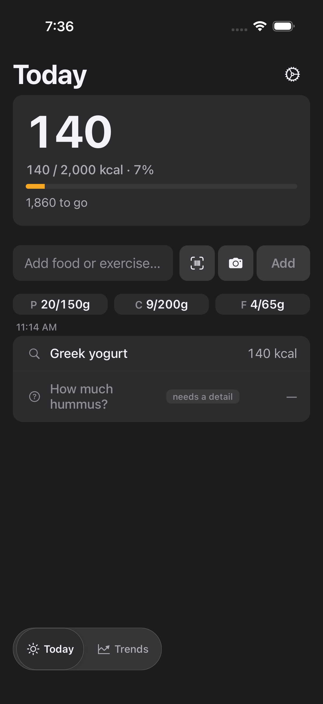
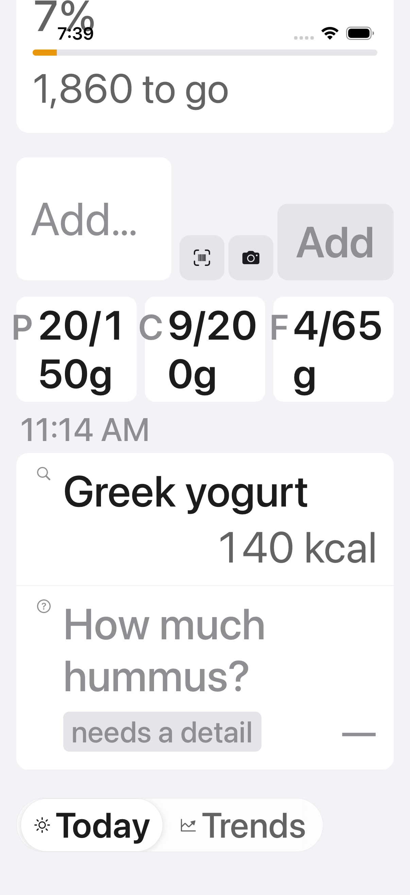
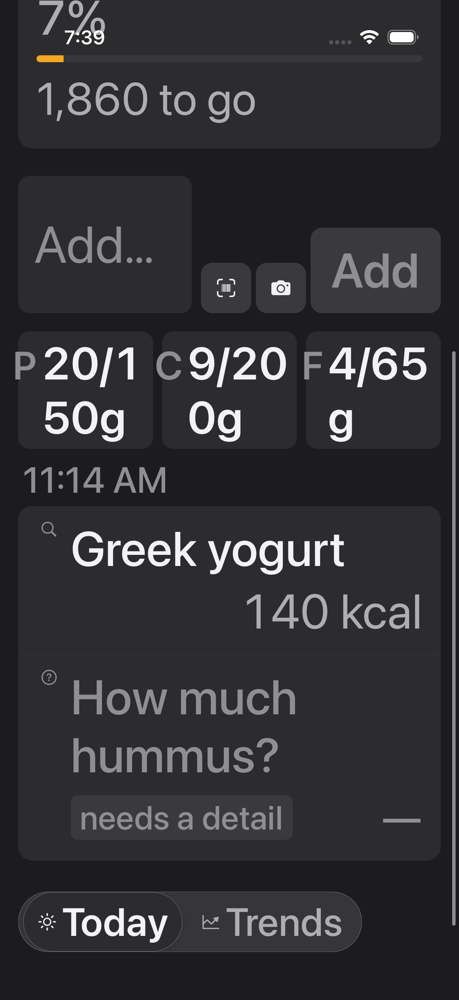

# FTY-360 — Timeline row reflows tag/kcal at Larger Accessibility sizes

Authoritative simulator visual evidence for FTY-360. Each screenshot below is
embedded by its **repo-relative path**, so it renders inline when this file is
viewed on GitHub. This committed README is the durable evidence artifact the
reviewer verifies; the PR body links here.

Captured on a leased headless iOS simulator (Slacks-Slot-0, iPhone 17, iOS 26.5)
serving this branch's JS in E2E mode, through the FTY-247 visual-review preset
`today.partially_resolved` (the FTY-330 mixed-log state whose item-scoped
pending-question row — "How much hummus?" — is the row that wraps). The active
iOS content-size category was driven externally with
`xcrun simctl ui <udid> content_size <size>` — the same OS Dynamic Type signal
the component reads via `useWindowDimensions().fontScale`, not a hardcoded width:

- **standard** = `content_size large` (default; fontScale ≈ 1.0)
- **accessibility-extra-large** = `content_size accessibility-extra-large`
  (fontScale ≈ 2.35, well above the 1.5 reflow cutoff)

Both themes were forced with the preset's `&theme=light|dark` param.

## Screenshots

### Standard Dynamic Type — Light

*Standard size (default…xxxLarge), light mode.* The pending-question row renders
on one horizontal line exactly as today — provenance icon + "How much hummus?" +
"needs a detail" tag + right-aligned em-dash — and the resolved "Greek yogurt ·
140 kcal" sibling keeps its reserved right-aligned kcal column. Unregressed
against the FTY-330 clean baseline.

### Standard Dynamic Type — Dark

*Standard size (default…xxxLarge), dark mode.* Same single-line layout, legible
in dark mode.

### Accessibility-extra-large — Light

*Accessibility-extra-large (fontScale ≈ 2.35), light mode.* The row reflows to a
vertical stack: "How much hummus?" uses the full row width and wraps cleanly **by
word** ("How much" / "hummus?"), with "needs a detail" + the em-dash reflowed to
a second line beneath it. No one-character-per-line collapse.

### Accessibility-extra-large — Dark

*Accessibility-extra-large (fontScale ≈ 2.35), dark mode.* Same clean word-wrap
reflow, legible in dark mode.

## What the evidence proves

- **Standard Dynamic Type is unregressed** — single horizontal line at both
  themes, matching the FTY-330 clean baseline byte-for-behaviour.
- **At the Larger Accessibility size the text wraps by word, never one glyph per
  line** — the question owns the full row width; tag + kcal reflow beneath it.
- **Every row variant, tag copy, provenance glyph, and value is preserved** —
  only the arrangement changes at AX sizes.
- **Light + dark both legible** at both sizes; **Reduce Motion unaffected** (the
  fix is a static layout branch keyed on the content-size category, no new
  motion).

## Further detail

Full capture methodology, reproduce steps, component-test coverage, and the
round-2 loading-skeleton footprint-parity note live in
[`findings.md`](findings.md).
