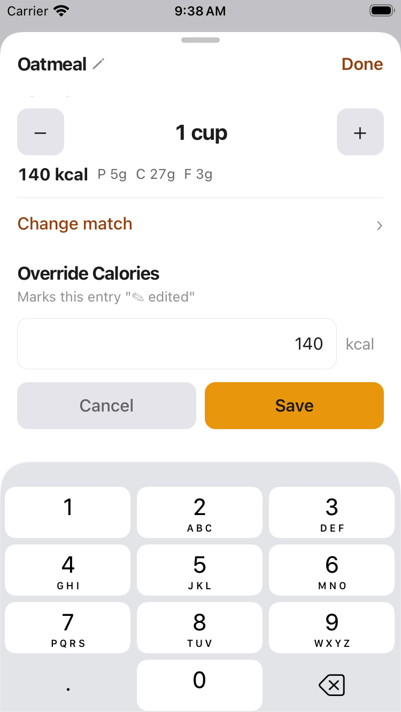
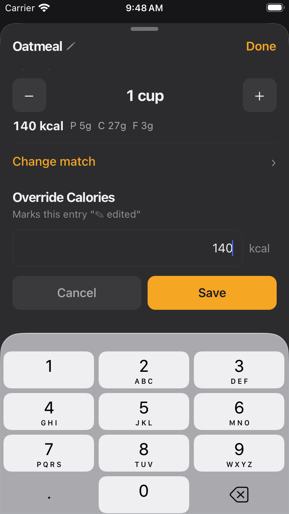
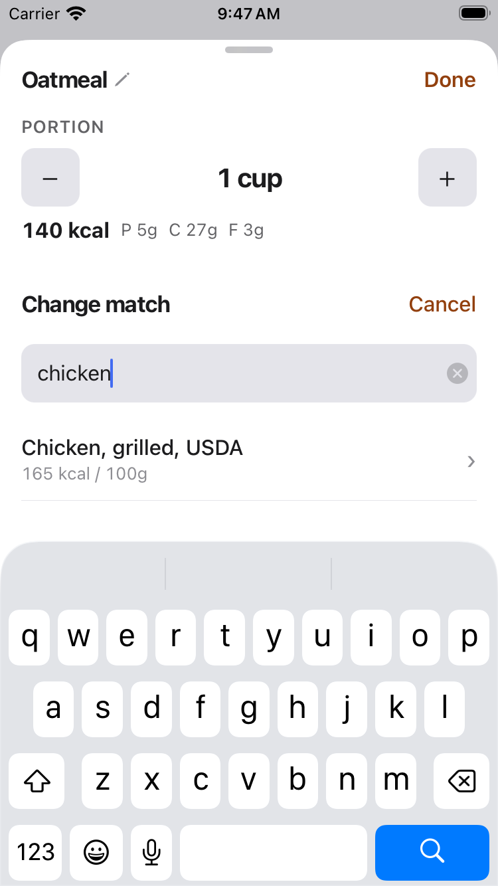
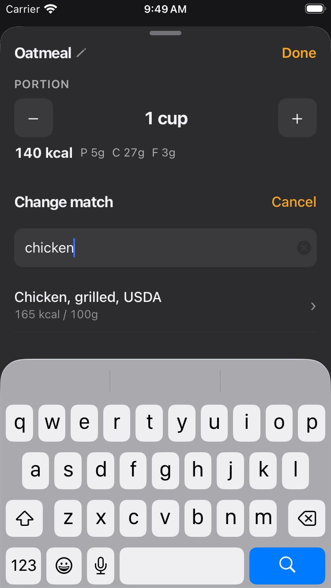

# FTY-404 — Keyboard no longer hides Save + match list in the correction sheet

Running-app evidence that, while a correction field is focused (software keyboard
up), the Save action and the match/typeahead result list stay visible and
reachable — the occlusion reported in the 2026-07-20 dogfood (item #6).

## Capture setup

- **Device:** iPhone SE (3rd generation) — the smallest supported width (375 pt)
  per `docs/design/ux-design.md` §7. Screenshots are native 750×1334.
- **Build:** this branch's JS served over Metro (`EXPO_PUBLIC_SLACKS_E2E=true`)
  onto a debug `Slacks.app`; correction sub-states opened via the FTY-263
  visual-review seam (`slacks://__visual-review?preset=…&theme=…`).
- **Both appearances** captured with `&theme=light|dark`.

## Criteria → evidence

### Save action visible + tappable with the keyboard up

The advanced-override panel (`correction.confirm_apply`) auto-focuses its input,
so the decimal keyboard is up. The override input **and** the Cancel / Save
buttons below it are fully visible above the keyboard — the content scrolls the
bottom-anchored action clear of the keyboard as it rises.

| Light | Dark |
| --- | --- |
|  |  |

### Match/typeahead list visible + scrollable while typing

The change-match panel (`correction.typeahead`) with the search field focused and
"chicken" typed: the search field is brought to the top of the space above the
keyboard and the candidate row ("Chicken, grilled, USDA · 165 kcal / 100g")
remains visible; the list scrolls in the space above the keyboard.

| Light | Dark |
| --- | --- |
|  |  |

## Mechanism

Keyboard-avoidance is driven by the platform keyboard inset — never a fixed
magic offset:

- `components/correction/useKeyboardInset.ts` reads the real keyboard height from
  the OS keyboard events; the correction sheet pads its scroll content by that
  height so every control can scroll clear of the keyboard, and holds across the
  supported device heights.
- When the keyboard rises, the sheet scrolls the active panel's key surface into
  the space above it: the bottom-anchored override/clarify commit action is
  scrolled to the end; the change-match search field is scrolled to the top so
  the match list stays visible and scrollable while typing.
